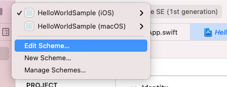
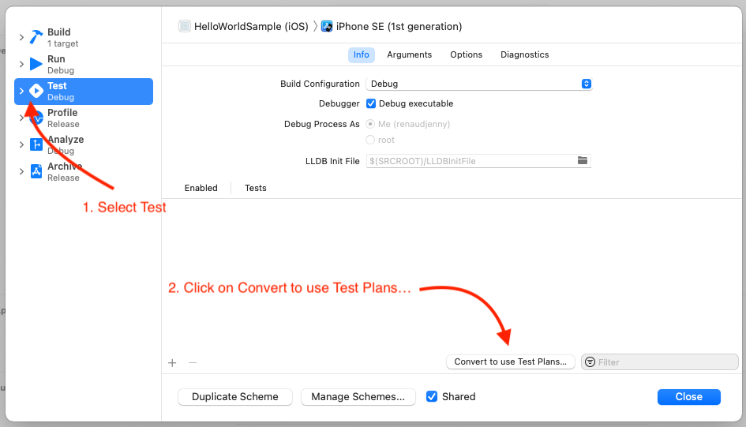
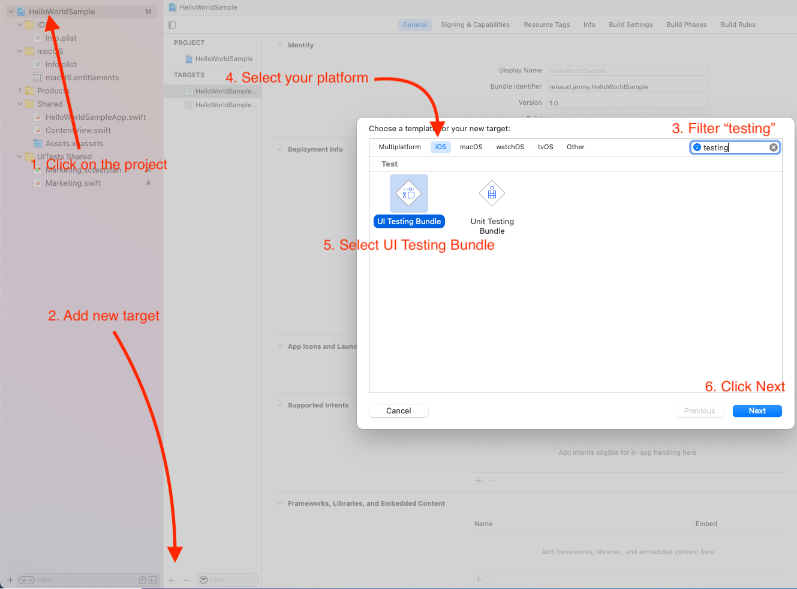
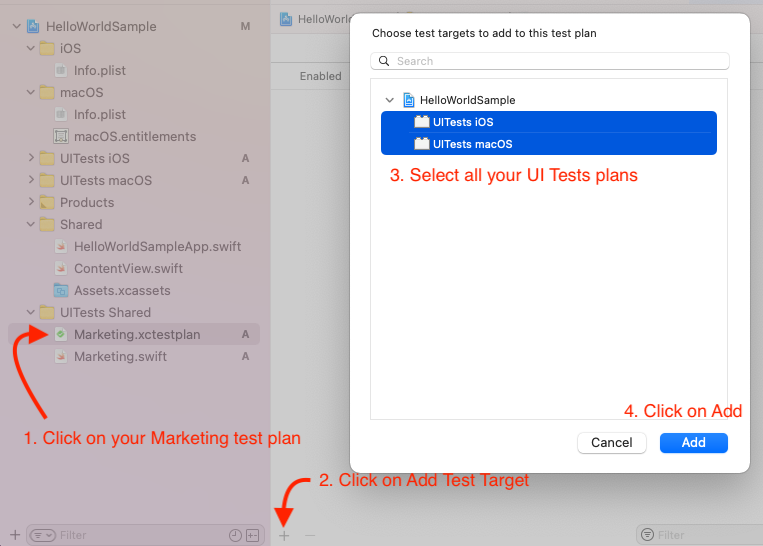
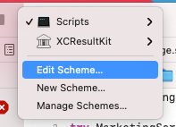
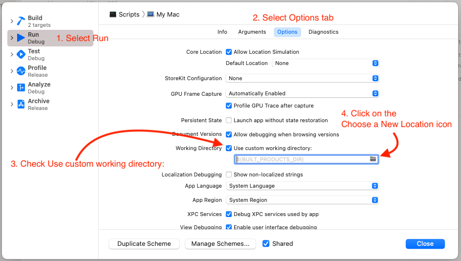

# MarketingScreenshots

This is useful to generate Marketing Screenshots automatically thanks to Test plan and via a simple Swift script.

A Sample project is available as test but also as example of how to integrate the script to your project.

Real project using it can be seen with [MemoArt](https://github.com/renaudjenny/MemoArt/blob/main/Scripts/Sources/Scripts/main.swift).

## Setup your Marketing test plan

Go on one of your project Scheme


Open **Test** in the first column, and click on **Convert to use Test Plans...** button


Choose the option that fits better for your project. "Create Test Plan from scheme" is certainly what you want.

Name your test plan to something meaningful, I personally go for "Marketing.xctestplan", because it will be dedicated to our Marketing Screenshots.
Also, I will place it into a folder named `UITests Shared` because these UI Tests will be shared between each platforms, but that doesn't really matter, the important thing is the name you will give to your test plan (bear this name in mind for later).

Once this is done, you will see a new interface for **Test**, you can select or unselect Marketing test plan as default or not, that doesn't matter for the later script.


Think about naming the function to something meaningful (this advice is always good anyway), the name of the test will be used to name your screenshot, for instance, MemoArt uses this names: `testGameScreenshot`, `testConfigurationScreenshot`, `testEasyDifficultyScreenshot`, etc.

If it's not done yet, add **UI Testing Bundle** for each platforms.


I personally rename the bundle to something simpler, like **UITests iOS** or **UITests macOS** or even **UITests** if I'm not in a multiplatform project. Also, as I'm using shared UI tests between platforms, I'm removing the default UI Test that is provided for each platform. But keep the `Info.plist` in your `UITests iOS` and equivalents.

Don't forget to repeat the process for every platform you're supporting for this project.

In a folder **UITests Shared** (or the equivalent one in your project). Add a new **UI Test Case Class**, and name it **Marketing**


When Xcode asks for **Target Membership** add all the **UITests bundle** you have. If you missed it, you can still do that later by selecting the test file -> Show File inspector and look for Target Membership.

Edit the file to add your screenshots, what's important is at some point you add screenshots commands, like this

```swift
import XCTest

class Marketing: XCTestCase {
    override func setUpWithError() throws {
        continueAfterFailure = true
        XCUIApplication().launch()
    }

    func testMainScreenScreenshot() throws {
        // Do whatever you want to navigate, tap on buttons, etc.

        // These are the instructions to make a screenshot that we can extract later on with the script
        let screenshot = XCUIApplication().screenshot()
        let attachment = XCTAttachment(screenshot: screenshot)
        attachment.lifetime = .keepAlways
        add(attachment)
    }
}
```

Obviously, add more tests if you want to, **every test should contain only one screenshot tho**.

Now click on **Marketing.xctestplan** and tap on the "+" button to "Add Test Target", select all the bundle you support.


You can manage multiple language (and generate screenshots for each languages you're supporting.

TODO 🛠

## Write your script

The easiest way to add the script to generate marketing screenshots automatically is to create a folder `Scripts` into your project and then create a Swift Package of type `executable` in it.

```bash
$ cd YourProject
$ mkdir Scripts
$ cd Scripts
$ swift package init --type=executable
```

To edit your fresh executable, the easiest way is to open the project with Xcode with this command:
```bash
$ open Package.swift
```

You can now edit the `Package.swift` file and add the `MarketingScreenshots` library to it. Also, don't forget to add the dependency to the **Scripts** target.

You also have to set the platforms to `.macOS(.v11)` because the library is supposed to only work for this target. If you skip this, you will get an error like
* `The package product 'MarketingScreenshots' requires minimum platform version 11.0 for the macOS platform, but this target supports 10.15`
* Or an other more generic error.

Your Package.swift should look like this:

```swift
// swift-tools-version:5.3
// The swift-tools-version declares the minimum version of Swift required to build this package.

import PackageDescription

let package = Package(
    name: "Scripts",
    platforms: [.macOS(.v11)],
    dependencies: [
        .package(url: "https://github.com/renaudjenny/MarketingScreenshots", from: "0.0.6"),
    ],
    targets: [
        .target(
            name: "Scripts",
            dependencies: ["MarketingScreenshots"]),
        .testTarget(
            name: "ScriptsTests",
            dependencies: ["Scripts"]),
    ]
)
```

You can now edit the file `Sources/Scripts/main.swift` to add what's needed for your project

```swift
import MarketingScreenshots

try MarketingScreenshots.iOS(
    devices: [
        .iPhoneSE_1st_Generation,
        .iPhone8Plus,
        .iPhoneSE_2nd_Generation,
        .iPhone12Pro,
        .iPhone12ProMax,

        .iPadPro_97,
        .iPadPro_129_2nd_Generation,
        .iPadPro_110_1st_Generation,
        .iPadPro_129_4th_Generation,
    ],
    projectName: "HelloWorldSample (iOS)"
)

try MarketingScreenshots.macOS(projectName: "HelloWorldSample (macOS)")
```

What you need to focus especially is what you put in the `projectName`. It should perfectly match the target name of what you're going to use for tests. In my case, that's `HelloWorldSample (iOS)` (notice the `(iOS)`), do not forget any space or parenthesis if your target name has some. Also, not that I slightly changed the name for the macOS target. And obviously, the `macOS` `projectName` should also match the target name.

You should be able to build the package with `CMD+B` but you won't be able to run it yet without error. The working directory has to be changed for this script to work.

To edit the working directory, you need to edit the scheme.


Select `Run` in the first column, select Options tab, Check "Use custom working directory" and click on the "Choose a New Location" icon.


Choose your project directory, basically where your `YourProject.xcproj` is.

Now you should be able to run the Script and visualise some screenshots if your test plan is well made.

## Github Action

TODO 🛠

## Libraries

This library is using
- [XCResultKit](https://github.com/davidahouse/XCResultKit) to get where to search for screenshots
- [XMLCoder](https://github.com/MaxDesiatov/XMLCoder) to parse XML with ease
- [ShellOut](https://github.com/JohnSundell/ShellOut) to use shell commands with ease
